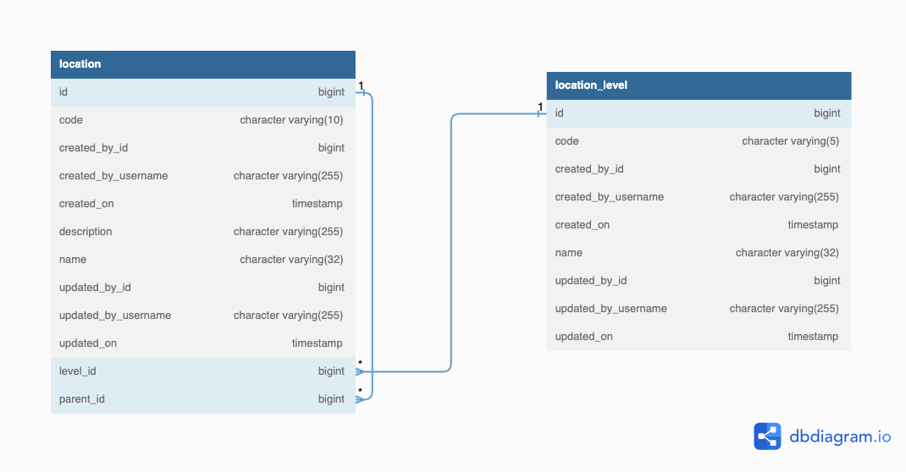

# Rwanda Political Locations

This repository contains Rwanda 🇷🇼 political locations: the files available in SQL format, it can be used as part of database

| Name               | Total Number |
| ------------------ | ------------:|
| IGIHUGU/Country    |            1 |
| INTARA/Province    |            5 |
| AKARERE/District   |           30 |
| UMURENGE/Sector    |          416 |
| AKAGARI/Cell       |        2,148 |
| UMUDUGUDU/Village  |       14,837 |

## ERD

## Usage
This file can be imported in postgresql database
